# **Práctica 1: Manejo de Ficheros y Directorios en Java (java.io.File)**

**Asignatura:** Acceso a Datos  
**Título de la práctica:** Práctica 1 \- Ficheiros  
**Autor:** Manuel Felipe Millán Peláez  
**Fecha:** 17-09-2026

## **1\. Introducción y Código de la Clase (ManejadorFicheros.java)**

En esta primera parte se implementan los métodos exigidos en el enunciado para interactuar con la clase java.io.File, permitiendo verificar la existencia de rutas, crear y borrar archivos/directorios, modificar permisos de lectura/escritura y listar contenidos.

## **2\. Guía de Pruebas y Documentación Gráfica (Parte 2\)**

A continuación se detalla la secuencia de ejecución requerida en la Parte 2 junto con la ubicación de las evidencias/capturas de pantalla.

### **Paso 1: Creación y comprobación de arquivosdir**

**Código ejecutado:**  
String basePath \= "/home/dam26/IdeaProjects/ad-p1-ficheros/arquivosdir";  
mf.creaDirectorio(basePath);  
System.out.println(mf.eDirectorio(basePath));

>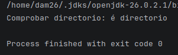
>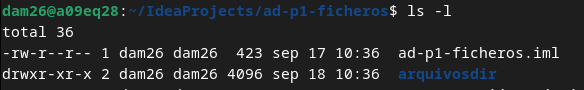

### **Paso 2: Creación y comprobación de Products1.txt**

**Código ejecutado:**  
mf.creaFicheiro(basePath, "Products1.txt");  
System.out.println(mf.eFicheiro(basePath \+ "/Products1.txt"));

>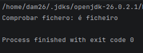
>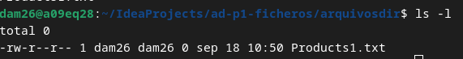

### **Paso 3: Creación de subdir y Products2.txt**

**Código ejecutado:**  
String subDirPath \= basePath \+ "/subdir";  
mf.creaDirectorio(subDirPath);  
mf.creaFicheiro(subDirPath, "Products2.txt");

>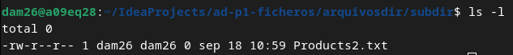

### **Paso 4: Contenido de primer nivel (mContido)**

**Código ejecutado:**  
mf.mContido(basePath);

>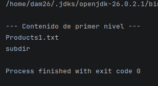

### **Paso 5: Información, edición manual y cambio de tamaño de Products1.txt**

**Código ejecutado:**  
System.out.println("--- Antes de editar \---");  
mf.modoAcceso(basePath, "Products1.txt");  
mf.calculaLonxitude(basePath, "Products1.txt");

// \[AQUÍ SE EDITA MANUAMENTE EL ARCHIVO EN EL SISTEMA OPERATIVO Y SE GUARDA CON EL TEXTO "ola"\]

System.out.println("--- Después de editar \---");  
mf.calculaLonxitude(basePath, "Products1.txt");

>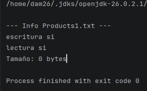
>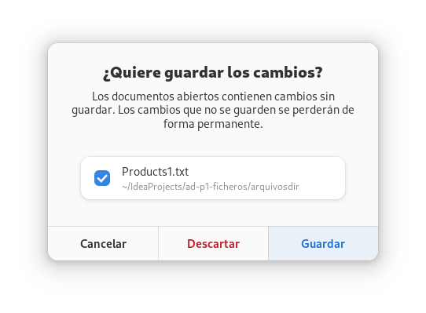
>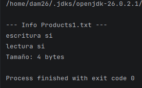

### **Paso 6: Forzar solo lectura (mLectura)**

**Código ejecutado:**  
mf.mLectura(basePath, "Products1.txt");

>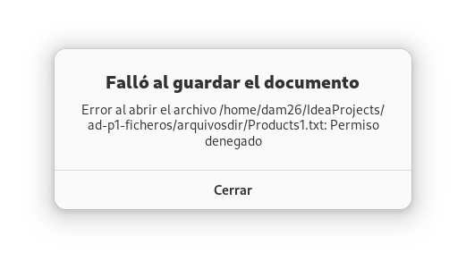
>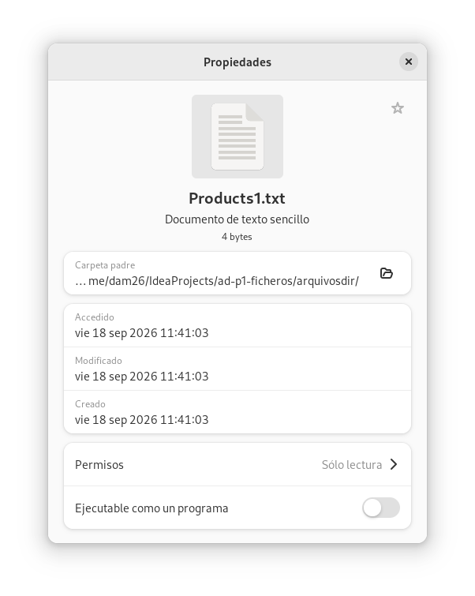

### **Paso 7: Restaurar permisos de escritura (mEscritura)**

**Código ejecutado:**  
mf.mEscritura(basePath, "Products1.txt");

>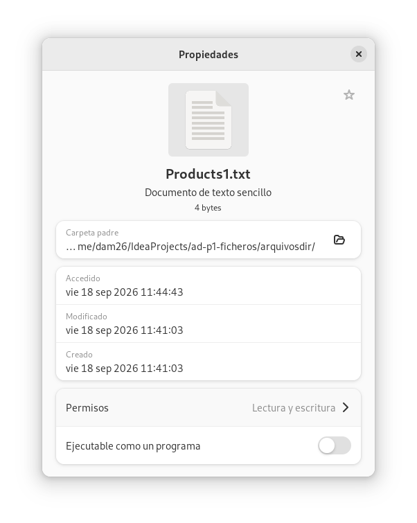

### **Paso 8: Borrado de Products1.txt**

**Código ejecutado:**  
mf.borraFicheiro(basePath, "Products1.txt");

>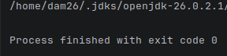
>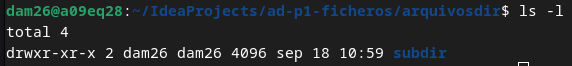

### **Paso 9: Limpieza total de archivos y directorios restantes**

**Código ejecutado:**  
// Se borra primero el archivo dentro del subdirectorio  
mf.borraFicheiro(subDirPath, "Products2.txt");

// Se borra el subdirectorio (ahora vacío)  
mf.borraDirectorio(subDirPath);

// Se borra el directorio principal (ahora vacío)  
mf.borraDirectorio(basePath);

>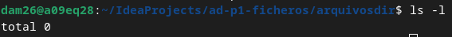

### **Paso 10 (Opcional): Recorrido recursivo (recur)**

**Código ejecutado:**  
File folderToRecur \= new File("/home/dam26/IdeaProjects/PSP_Tarea_01/");  
mf.recur(folderToRecur);

>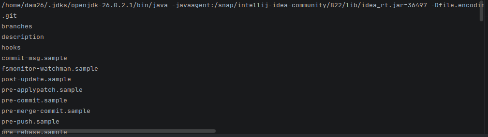